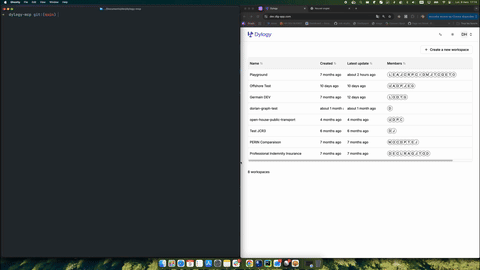

# Dylogy API MCP

MCP server that auto-generates tools from the Dylogy OpenAPI spec.
Authenticates, fetches the spec, and exposes each API route as a callable tool.



## Setup

```bash
# Install dependencies
uv sync
```

## Add to Claude Code

```bash
claude mcp add dylogy \
  -e DYLOGY_API_BASE="https://dev.dlg-api.com" \
  -e DYLOGY_EMAIL="your-email@dylogy.com" \
  -e DYLOGY_PASSWORD="your-password" \
  -- uv run --directory /path-to/dylogy-mcp python dylogy.py
```

## Verify

```bash
claude mcp list        # check it's registered
claude mcp get dylogy  # check it's healthy
```

## Custom Tools

In addition to auto-generated tools from the Dylogy OpenAPI spec, the server exposes the following custom tools:

| Tool | Description |
|------|-------------|
| `view_document_graph` | Fetch a document's knowledge graph and open an interactive React Flow viewer in the browser |
| `graph_to_mermaid` | Convert a document's knowledge graph to a Mermaid flowchart diagram |
| `graph_stats` | Compute analytics on a document's knowledge graph: topology, longest causal chain, hub nodes, causation/category distributions |
| `compare_document_graphs` | Compare two document graphs side-by-side: node/edge counts, causation distributions, category overlap, structural similarity |
| `export_environment_report` | Generate a full markdown report for an environment: document inventory, analysis success rates, graph summaries, and per-document details |
| `create_pdf_report` | Generate a styled PDF from markdown content with Dylogy logo header and page numbers |
| `create_rich_pdf_report` | Generate a rich PDF with support for LaTeX math, Mermaid diagrams, and embedded images |
| `search_actuarial_library` | Search the ressources-actuarielles.net actuarial library (ISFA) for academic papers and memoirs |

