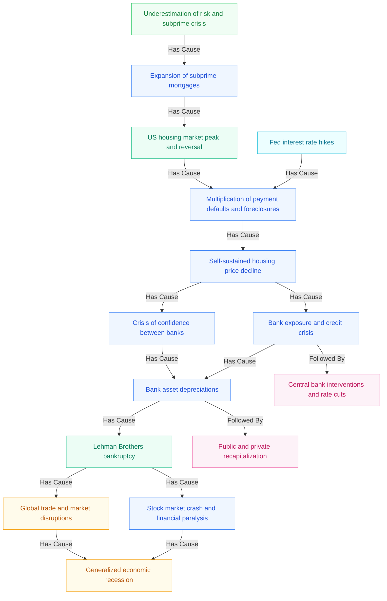

# Graph Analysis Report: mars2009_d1_test.pdf

**Document:** mars2009_d1_test.pdf
**Environment:** dorian-graph-test (`01KFNW0VWFYQMR8WBBWSX5FWNX`)
**Document ID:** `01KH6SANPR0E69K5Z7FVAK3TJW`
**Graph ID:** `01KH6SF8GKVTSWMJXZAC7CHY86`
**Generated:** 2026-03-11

---

## 1. Summary

This knowledge graph models the **causal chain of the 2008 global financial crisis**, extracted from the mars2009_d1_test document. The graph captures 15 key events spanning from 2000 to 2009, connected by 16 causal and temporal relationships.

| Metric | Value |
|--------|-------|
| Nodes | 15 |
| Edges | 16 |
| Density | 7.6% |
| Sub-graphs merged | 4 |
| Merge method | LLM |
| Longest causal chain | 10 nodes |
| Hub node | Bank asset depreciations (4 connections) |

### Global Properties
- **Currency:** USD
- **Total loss amount:** $2,800,000,000,000 ($2.8 trillion)

---

## 2. Nodes (Events)

| ID | Event | Category | Date |
|----|-------|----------|------|
| 1 | Underestimation of risk and subprime crisis | Defective workmanship | 2000-01-01 |
| 2 | Expansion of subprime mortgages | Business Interruption | 2007-01-01 |
| 3 | US housing market peak and reversal | Collapse | 2006-06-01 |
| 4 | Fed interest rate hikes | Business Interruption | 2004-01-01 |
| 5 | Multiplication of payment defaults and foreclosures | Business Interruption | 2007-01-01 |
| 6 | Self-sustained housing price decline | Collapse | 2007-01-01 |
| 7 | Bank exposure and credit crisis | Credit Loss | 2007-08-01 |
| 8 | Crisis of confidence between banks | Business Interruption | 2007-07-01 |
| 9 | Bank asset depreciations | Asset Depreciation | 2007-07-01 |
| 10 | Lehman Brothers bankruptcy | Business Interruption | 2008-09-15 |
| 11 | Stock market crash and financial paralysis | Market Collapse | 2008-09-15 |
| 12 | Global trade and market disruptions | Trade contraction | 2008-09-15 |
| 13 | Generalized economic recession | Business Interruption | 2008-12-01 |
| 14 | Central bank interventions and rate cuts | Monetary Policy Intervention | 2007-08-01 |
| 15 | Public and private recapitalization | Recapitalization | 2009-01-01 |

---

## 3. Edges (Relationships)

| From | To | Relation |
|------|----|----------|
| Underestimation of risk and subprime crisis | Expansion of subprime mortgages | HAS_CAUSE |
| Expansion of subprime mortgages | US housing market peak and reversal | HAS_CAUSE |
| US housing market peak and reversal | Multiplication of payment defaults and foreclosures | HAS_CAUSE |
| Fed interest rate hikes | Multiplication of payment defaults and foreclosures | HAS_CAUSE |
| Multiplication of payment defaults and foreclosures | Self-sustained housing price decline | HAS_CAUSE |
| Self-sustained housing price decline | Crisis of confidence between banks | HAS_CAUSE |
| Self-sustained housing price decline | Bank exposure and credit crisis | HAS_CAUSE |
| Crisis of confidence between banks | Bank asset depreciations | HAS_CAUSE |
| Bank exposure and credit crisis | Bank asset depreciations | HAS_CAUSE |
| Bank exposure and credit crisis | Central bank interventions and rate cuts | FOLLOWED_BY |
| Bank asset depreciations | Lehman Brothers bankruptcy | HAS_CAUSE |
| Bank asset depreciations | Public and private recapitalization | FOLLOWED_BY |
| Lehman Brothers bankruptcy | Global trade and market disruptions | HAS_CAUSE |
| Lehman Brothers bankruptcy | Stock market crash and financial paralysis | HAS_CAUSE |
| Global trade and market disruptions | Generalized economic recession | HAS_CAUSE |
| Stock market crash and financial paralysis | Generalized economic recession | HAS_CAUSE |

---

## 4. Topology Analysis

### Root Nodes (no incoming edges — crisis triggers)
- **Fed interest rate hikes** (2004) — monetary policy trigger
- **Underestimation of risk and subprime crisis** (2000) — systemic risk origin

### Leaf Nodes (no outgoing edges — final outcomes)
- **Central bank interventions and rate cuts** — mitigation response
- **Generalized economic recession** — ultimate consequence
- **Public and private recapitalization** — recovery action

### Hub Node
- **Bank asset depreciations** — 4 connections (2 incoming, 2 outgoing), making it the central pivot point where banking sector stress translated into systemic failure.

---

## 5. Causation Distribution

| Type | Count |
|------|-------|
| DirectConsequence | 7 |
| TriggerEvent | 2 |
| IndirectConsequence | 2 |
| MitigationAction | 2 |
| SecondaryCause | 1 |
| PrimaryCause | 1 |

---

## 6. Event Category Distribution

| Category | Count |
|----------|-------|
| Business Interruption | 6 |
| Collapse | 2 |
| Trade contraction | 1 |
| Monetary Policy Intervention | 1 |
| Defective workmanship | 1 |
| Credit Loss | 1 |
| Asset Depreciation | 1 |
| Market Collapse | 1 |
| Recapitalization | 1 |

---

## 7. Longest Causal Chain

The longest chain (10 events) traces the full crisis arc from root cause to final outcome:

```
Underestimation of risk (2000)
  -> Expansion of subprime mortgages (2007)
    -> US housing market peak and reversal (2006)
      -> Multiplication of payment defaults (2007)
        -> Self-sustained housing price decline (2007)
          -> Crisis of confidence between banks (2007-07)
            -> Bank asset depreciations (2007-07)
              -> Lehman Brothers bankruptcy (2008-09-15)
                -> Global trade and market disruptions (2008-09-15)
                  -> Generalized economic recession (2008-12)
```

---

## 8. Key Insights

1. **Dual trigger points:** The crisis had two independent root causes — long-term risk underestimation (systemic) and Fed rate hikes (policy-driven) — that converged at the "payment defaults" node.

2. **Pivotal node:** Bank asset depreciations is the critical junction. It receives pressure from both the interbank confidence crisis and direct credit losses, then triggers the Lehman collapse downstream.

3. **Mitigation branches:** Two FOLLOWED_BY edges diverge from the main causal chain — central bank interventions and recapitalization — representing reactive measures rather than causal consequences.

4. **Convergent endpoints:** Both the stock market crash and global trade disruptions independently feed into the final recession, showing multiple reinforcing paths to the same outcome.

5. **Timeline span:** The crisis unfolded over ~9 years (2000-2009), with the acute phase concentrated in 2007-2008.

---

## 9. Mermaid Diagram



---

*Report generated from Dylogy graph analysis on 2026-03-11.*
